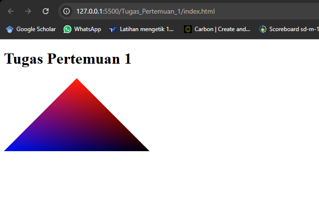
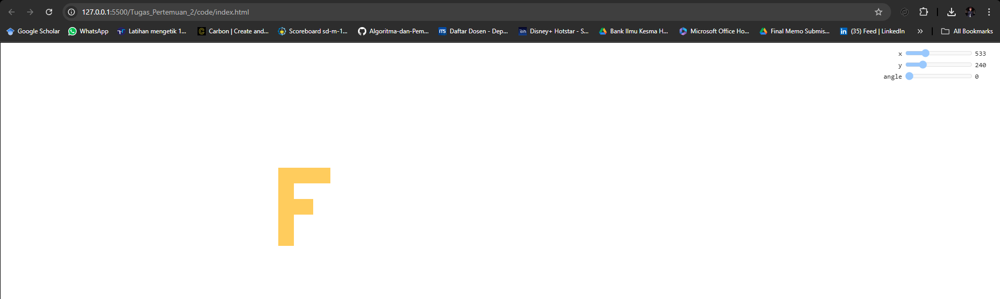
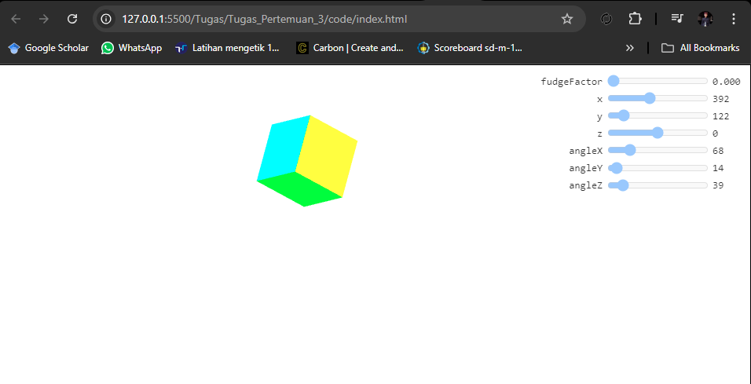
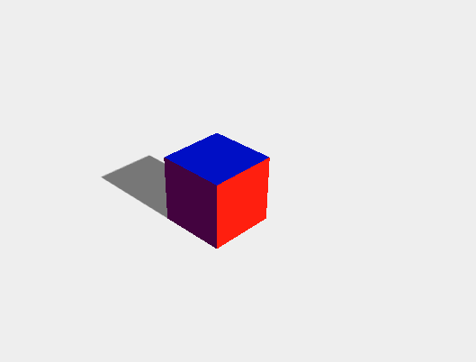

| :---: | :------------------------: |
|  Nama |   Lalu Aldo Wadagraprana   |
|  NRP  |        5025221101          |
| Kelas |     Grafika Komputer A     |

# Overview Singkat

Dalam Repository ini Saya membuat kegiatan mingguan sebagai pelaporan progres pembelajaran dalam kelas Grafika Komputer A.

## Tugas Pertemuan 1

Dalam Tugas ini, saya membuat segitiga dengan 3 warna pada tiap titiknya.

## Tugas Pertemuan 2

Dalam Tugas ini, membuat object berbentuk F, bisa melakukan Translation sumbu X dan Y, dan bisa melaukan rotating.

## Tugas Pertemuan 3

Dalam Tugas ini, saya membuat objek 3d kubus, yang bisa melakukan rotating angle x, y, z, Prespectife 3d, dengan fudgefactor untuk mengubah atau memodifikasi rendering secara visual, seperti memperbaiki masalah tampilan geometri, skala, atau efek perspektif, dan translation.

## Tugas Pertemuan 9

Dalam Tugas ini, saya membuat object 3d kubus, dalam object 3d ini juga memeiliki shadow dan lighting.

animasi dan user interaction (Keyboard) untuk mengganti mode:
- arrow up : maju
- arrow down : mundur
- arrow right : kanan
- arrow left : kiri
- q : rotating sumbu y clockwise
- e : rotating sumbu y counter clockwise
- w : melakukan flip depan
- a : melakukan flip kiri
- s : melakukan flip belakang
- d : melakukan flip kanan
- space : melakukan jump

